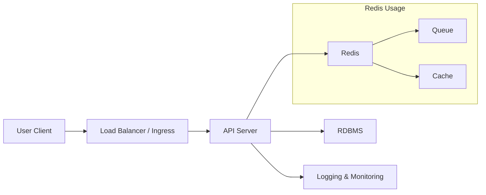

# Infrastructure Diagram

## Overview
본 서비스는 "콘서트 예약" 트래픽 피크(오픈 시간 동시 접속)를 대비하여
대기열(Queue)과 캐시(Redis)를 중심으로 구성한다.
좌석 중복 예약 방지는 DB 트랜잭션/락으로 보장한다.

## Diagram

 

## Components

### 1) Load Balancer / Ingress
- 외부 트래픽을 받아 API 서버로 분산한다.
- TLS 종료(SSL offloading)를 LB/Ingress에서 처리할 수 있다.
- 서버 증설(Scale-out) 시 클라이언트 변경 없이 트래픽 분산 가능.

### 2) API Server (Spring Boot)
- OpenAPI 기준으로 다음 기능을 제공한다.
  - 대기열 토큰 발급/상태 조회
  - 콘서트 날짜/좌석 조회
  - 좌석 예약(임시배정 5분)
  - 포인트 충전/조회
  - 결제(포인트 차감 + 좌석 확정)
  - 좌석 중복 예약 방지는 DB 트랜잭션 + 행 잠금 방식으로 보장한다.

### 3) MySQL (RDBMS)
- 서비스의 최종 정합성 소스(Source of Truth).
- 좌석 상태와 예약/결제 이력을 저장한다.
- 임시배정 만료 시간을 저장하고, 만료 정리 작업이 가능하도록 인덱스를 둔다.

### 4) Redis
- 대기열(Queue) 구현:
  - waiting: ZSET(순번)
  - active: SET/KEY(TTL로 활성 세션 관리)
- 캐시(Cache):
  - 콘서트 날짜, 좌석 조회 결과 캐싱(짧은 TTL)
  - 오픈 시점 트래픽에서 DB 부하를 낮추고 응답을 빠르게 한다.

### 5) Logging / Monitoring
- 애플리케이션 로그(구조화 로그), 에러율, latency, DB 커넥션 수 등을 모니터링한다.
- 임계치 초과 시 알림(Slack/Email) 연동을 고려한다.

